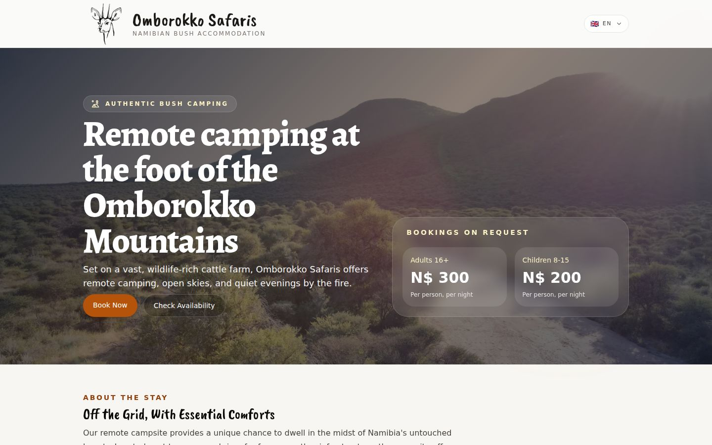
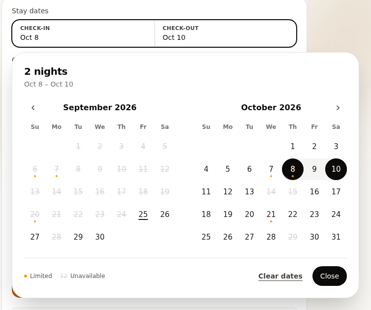
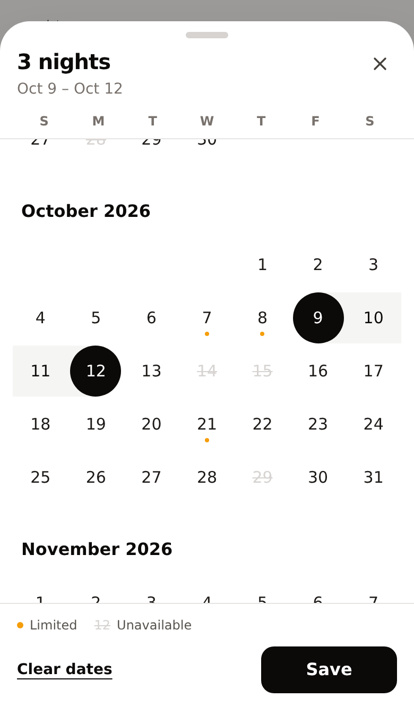
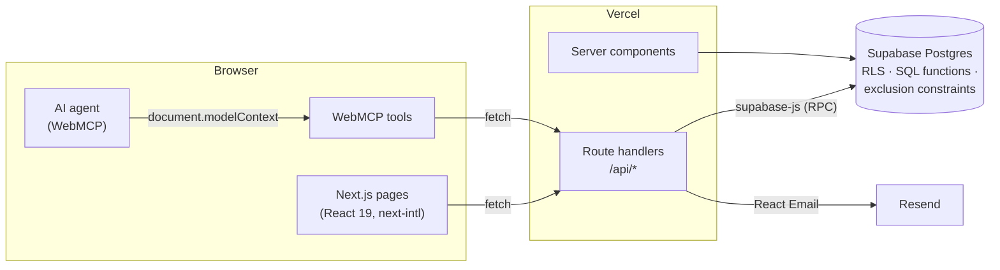

# Omborokko Safaris

**A multilingual booking platform for a remote bush campsite in Namibia.** Guests check live availability, see prices and send booking requests in six languages. The owners review and confirm them from an admin dashboard. The site also exposes its booking flow to AI agents through **WebMCP**.




<table>
  <tr>
    <td width="62%"></td>
    <td width="38%"></td>
  </tr>
  <tr>
    <td align="center"><sub>Desktop: two-month popover with hover preview</sub></td>
    <td align="center"><sub>Mobile: swipeable bottom sheet</sub></td>
  </tr>
</table>

---

## Contents

- [Highlights](#highlights)
- [Features](#features)
  - [Booking experience](#booking-experience)
  - [Internationalisation (i18n)](#internationalisation-i18n)
  - [WebMCP: tools for AI agents](#webmcp-tools-for-ai-agents)
  - [Admin dashboard](#admin-dashboard)
  - [Transactional email](#transactional-email)
  - [SEO](#seo)
- [Architecture](#architecture)
- [Data model and integrity](#data-model-and-integrity)
- [Tech stack](#tech-stack)
- [Getting started](#getting-started)
- [Project structure](#project-structure)

## Highlights

- **Request-and-confirm booking flow.** Guests send a request with no payment up front; the owners confirm or decline it and the guest is emailed either way.
- **Airbnb-style date picker.** A full-height bottom sheet on phones, a two-month popover on desktop, with live availability on every night.
- **Six languages.** English, German, French, Afrikaans, Spanish and Italian, with locale-prefixed URLs, localised dates and plurals, and `hreflang` SEO.
- **WebMCP tools.** In-browser AI agents can check availability, get a quote, request a booking and look up its status through structured tools instead of scraping the page.
- **Double bookings prevented by the database.** PostgreSQL exclusion constraints reject any overlapping confirmed stay or block on the same campsite.
- **Fast availability.** One set-based SQL query computes 18 months of nightly availability in about 7 ms.

## Features

### Booking experience

- **Live availability calendar.** Fully booked nights are struck through and nearly full nights carry an amber dot. Once check-in is chosen, dates after the next fully booked night are disabled, so a guest can't select a stay that runs through it.
- **Responsive date picker.** Built on `react-day-picker` with Radix primitives:
  - **Phones:** a full-height bottom sheet with a scrolling list of months, a sticky weekday header, large touch targets, swipe-down to dismiss and haptic feedback. Selections stay a draft until **Save**.
  - **Desktop:** a two-month popover with a hover preview of the range and a live "3 nights · Oct 9 – Oct 12" summary.
- **Quick availability check on the homepage.** Pick dates and the number of campsites to see at once whether the stay fits.
- **Safe to retry.** Each submission carries a client-generated request ID. Retries after a network failure return the original request instead of creating a duplicate, and the page can recover a request whose response was lost.
- **Request status tracking.** The guest's latest request is remembered in the browser and refreshed every 30 seconds until it's rejected or cancelled. Guests can also look a request up by email and booking reference.
- **Pricing.** Per person per night, with separate adult and child rates, capacity limits per campsite and no cleaning fee.

### Internationalisation (i18n)

Built with [`next-intl`](https://next-intl.dev) on the App Router.

| | |
|---|---|
| **Locales** | `en` (default), `de`, `fr`, `af`, `es`, `it` |
| **Routing** | Every public URL is locale-prefixed (`/de/book`). Middleware redirects `/` to the visitor's preferred language. |
| **Messages** | One JSON catalogue per locale in [`messages/`](messages), using ICU syntax for plurals (`{count, plural, one {# night} other {# nights}}`). |
| **Dates and numbers** | `Intl.DateTimeFormat` for labels, and matching `date-fns` locales so calendars start the week on the right day for each language. |
| **Validation** | Zod schemas take translated messages, so form errors appear in the visitor's language. |
| **SEO** | Per-locale `<title>` and descriptions, `hreflang` alternates with `x-default`, and a sitemap entry per locale. |
| **Switcher** | A flag dropdown that keeps the visitor on the same page when changing language. |

### WebMCP: tools for AI agents

[WebMCP](https://github.com/webmachinelearning/webmcp) is a proposed web standard that lets a page publish structured, callable **tools** for AI agents running in the browser, so an agent can act through the site's own logic instead of clicking through the UI. This site registers five tools from the public layout ([`features/webmcp/booking-tools.ts`](features/webmcp/booking-tools.ts)):

| Tool | Kind | What it does |
|---|---|---|
| `get_campsite_pricing` | read-only | Adult and child rates, capacity and fees, plus an optional quote for given dates and guests |
| `check_availability` | read-only | Whether a stay fits the number of campsites needed, and how many are free |
| `get_availability_calendar` | read-only | Fully booked and nearly full nights in a date range, to help find open dates |
| `request_booking` | consequential | Sends a booking request and returns its reference |
| `find_booking_request` | read-only | Status, dates and any message from the owners, by email and reference |

```ts
// Simplified from components/webmcp-tools.tsx
const controller = new AbortController();

for (const tool of createBookingTools({ locale, queryClient })) {
  await document.modelContext.registerTool(tool, { signal: controller.signal });
}

// Aborting the signal unregisters every tool when the layout unmounts.
return () => controller.abort();
```

How the integration is built:

- **Same code paths as the UI.** Tools call the same API routes as the site, so server-side validation and availability checks apply to agents too.
- **The page reflects what the agent does.** When an agent sends or finds a request, the booking form on the page updates to show it.
- **Designed for agents.** Inputs are validated with clear, correctable error messages ("checkInDate 2020-01-01 is in the past. Today is 2026-09-25."), and each tool is annotated with `readOnlyHint` or `consequentialHint` so agents know which actions need the user's approval.
- **Progressive enhancement.** In browsers without WebMCP nothing is registered and nothing changes. Types come from the official [`webmcp-types`](https://www.npmjs.com/package/webmcp-types) package.

**Try it:** in Chrome, enable `chrome://flags/#enable-webmcp-testing`, open the site and connect a WebMCP-capable agent. For production visitors, set `WEBMCP_ORIGIN_TRIAL_TOKEN` to a [Chrome origin trial](https://developer.chrome.com/origintrials) token; the site sends it as an `Origin-Trial` header.

### Admin dashboard

A separate `/admin` area, restricted to users with the `admin` role:

- **Dashboard:** booking counts by status and a monthly revenue chart (Recharts).
- **Bookings:** a searchable, filterable table (TanStack Table), plus a detail page to confirm or reject a request with a message to the guest. Confirming assigns free campsites in a single database transaction.
- **Calendar:** month and agenda views of bookings and blocks (React Big Calendar).
- **Units:** manage campsites, capacity and pricing.
- **Blocks:** close campsites for maintenance or private use.

### Transactional email

Templates are built with [React Email](https://react.email) and sent through [Resend](https://resend.com):

- **New request:** a summary to the guest, and a notification to the owners with the guest's details.
- **Status change:** the guest is emailed when a request is confirmed, rejected or cancelled, including the owners' message.

Preview the templates locally with `pnpm email:dev`. Email is skipped cleanly when Resend isn't configured.

### SEO

- `Campground` JSON-LD structured data (schema.org) on the homepage.
- Open Graph and Twitter cards, canonical URLs and `hreflang` alternates.
- A generated `sitemap.xml` covering every locale, and a `robots.txt` that keeps `/admin`, `/api` and `/login` out of search results.

## Architecture



- **Server components** render public pages and read campsite details directly from Supabase.
- **Route handlers** in `app/api` validate every request with Zod and call PostgreSQL functions (RPCs) for anything that needs to be atomic or has to check availability.
- **Client state** uses TanStack Query. Nightly availability is fetched once, cached, and shared by every date picker and the WebMCP tools.
- **Middleware** combines `next-intl` locale routing with refreshing the Supabase session.

## Data model and integrity

| Table | Purpose |
|---|---|
| `campsite_units` | Campsites, capacity, adult and child pricing |
| `bookings` | Booking requests: guest details, dates, party size, price snapshot, status |
| `booking_units` | Which campsites a confirmed booking occupies, and when |
| `booking_blocks` | Periods a campsite is closed |
| `profiles` | Links Supabase Auth users to a role (`admin` or `customer`) |

How the database keeps the data correct:

- **No double bookings.** `EXCLUDE USING gist (campsite_unit_id WITH =, daterange(start_date, end_date, '[)') WITH &&)` on assignments and blocks makes overlapping stays on the same campsite impossible, even under concurrent requests.
- **Access control.** Row Level Security is on for every table. Guests never read other bookings; the public availability functions are `SECURITY DEFINER` and return counts only.
- **Atomic workflows.** Creating a request (`create_booking_request`) and confirming it (`admin_confirm_booking`) are single PostgreSQL functions, so availability checks and writes happen in one transaction.
- **Set-based availability.** `get_campsite_nightly_availability` reads the overlapping bookings and blocks once and counts occupied campsites per night. It replaced a per-night loop and brought a 120-night query from **382 ms to 1.8 ms**; the full 18-month calendar takes about 7 ms.
- **Versioned migrations** live in [`supabase/migrations`](supabase/migrations) and are applied with `supabase db push`.

## Tech stack

| Area | Tools |
|---|---|
| Framework | Next.js 15 (App Router), React 19, TypeScript |
| Styling and UI | Tailwind CSS, Radix UI primitives, shadcn/ui-style components, Lucide icons |
| Data and auth | Supabase (PostgreSQL, Auth, Row Level Security), `@supabase/ssr` |
| Client data | TanStack Query, TanStack Table |
| Forms and validation | React Hook Form, Zod |
| Dates and calendars | date-fns, react-day-picker, React Big Calendar |
| i18n | next-intl |
| AI agents | WebMCP (`document.modelContext`), `webmcp-types` |
| Email | React Email, Resend |
| Charts | Recharts |
| Hosting and analytics | Vercel, Vercel Analytics, Speed Insights |

## Getting started

### Prerequisites

- Node.js 22 and pnpm 10 (`corepack enable` sets up the pinned pnpm version)
- A [Supabase](https://supabase.com) project
- Optional: a [Resend](https://resend.com) account for email

### 1. Install

```bash
git clone https://github.com/hcdiekmann/omborokko.git
cd omborokko
pnpm install
```

### 2. Configure the environment

Copy `.env.example` to `.env.local` and fill it in:

| Variable | Required | Description |
|---|---|---|
| `NEXT_PUBLIC_SUPABASE_URL` | yes | Supabase project URL |
| `NEXT_PUBLIC_SUPABASE_PUBLISHABLE_KEY` | yes | Supabase publishable (anon) key |
| `SUPABASE_SERVICE_ROLE_KEY` | no | Service role key; not needed to run the app |
| `APP_URL` | no | Public site URL, used in emails, the sitemap and canonical links |
| `RESEND_API_KEY`, `RESEND_FROM_EMAIL`, `RESEND_FROM_NAME` | no | Enable transactional email |
| `BOOKING_ADMIN_EMAILS` | no | Comma-separated addresses notified of new requests |
| `BOOKING_REPLY_TO_EMAIL` | no | Reply-to address on guest emails |
| `WEBMCP_ORIGIN_TRIAL_TOKEN` | no | Chrome/Edge origin trial token that enables WebMCP for visitors |

### 3. Set up the database

```bash
npx supabase login
npx supabase link --project-ref <your-project-ref>
npx supabase db push                     # apply the migrations
```

To load the sample campsites, run [`supabase/seed.sql`](supabase/seed.sql) in the Supabase SQL Editor.

Create a user under **Authentication → Users → Add user** in the Supabase dashboard (a `profiles` row is created for it automatically), then make it an admin and sign in at `/login`:

```sql
update public.profiles set role = 'admin' where id = '<your-auth-user-id>';
```

### 4. Run it

```bash
pnpm dev          # http://localhost:3000
```

| Script | Description |
|---|---|
| `pnpm dev` | Start the development server |
| `pnpm build` / `pnpm start` | Production build and server |
| `pnpm typecheck` | Type-check the project |
| `pnpm email:dev` | Preview the email templates at http://localhost:3002 |

The project deploys to Vercel as-is; [`vercel.json`](vercel.json) pins the pnpm version used for installs.

## Project structure

```text
app/
  [locale]/            Public pages per language (home, book)
  admin/               Admin dashboard (bookings, calendar, units, blocks)
  api/                 Route handlers (availability, pricing, bookings, admin)
  login/               Admin sign-in (Supabase Auth, email and password)
  sitemap.ts, robots.ts
components/            UI components (date picker, booking form, admin views)
  ui/                  Design-system primitives (button, calendar, sheet, ...)
emails/                React Email templates
features/
  bookings/server/     Availability, pricing and booking services
  bookings/client/     Shared availability query and request storage
  webmcp/              WebMCP tool definitions
i18n/                  next-intl routing and request config
messages/              Translation catalogues (en, de, fr, af, es, it)
lib/                   Supabase clients, auth guards, validation, email, utilities
supabase/
  migrations/          Versioned SQL migrations
  seed.sql             Sample campsites
types/                 Generated database types and WebMCP types
```

---

Built by [Hans Christian Diekmann](https://github.com/hcdiekmann).
